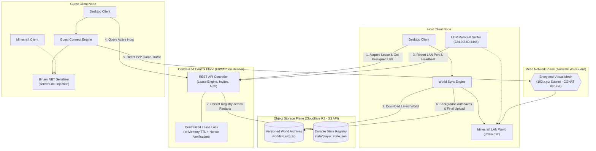

# P2P-WorldSync: Distributed Host Coordination & State Synchronization Engine

> **The Big Idea:** Imagine playing on a shared Minecraft world with your friends that costs **$0/month** and doesn't rely on an expensive 24/7 paid server. Instead of the world being trapped on one person's computer, the save file lives safely in the cloud. Whoever wants to play simply clicks **"Host World"**, picks up the world "baton", and friends connect peer-to-peer with zero port forwarding or IP typing. When the host logs off, the world automatically syncs back to the cloud so the next friend can take over whenever they want.

**Under the Hood:** **P2P-WorldSync** couples a centralized control plane (FastAPI on Render) with peer-to-peer gameplay hosting and Cloudflare R2 object storage. Rather than running a continuous dedicated server, the control plane coordinates an in-memory lease-based lock with 30-second heartbeats. Any authorized peer can dynamically acquire the hosting lease, stream and unpack authoritative world archives from Cloudflare R2, capture dynamic runtime LAN ports via UDP multicast sniffing, and establish direct peer-to-peer WireGuard tunnels across Carrier-Grade NAT (CGNAT) boundaries—achieving persistent multiplayer with zero manual port forwarding and zero ongoing server compute costs while cloud free tiers last.

---

## 💡 The Problem & The Solution

| Approach | Limitations & Pain Points | P2P-WorldSync Solution |
|---|---|---|
| **24/7 Paid Server** *(Realms, VPS)* | Costs \$5–\$20/month even when idle; complex server management and recurring billing. | **Zero cost while cloud free tiers last.** Uses free-tier infrastructure (Render web service + Cloudflare R2 storage). Zero idle compute costs. |
| **Vanilla Singleplayer / LAN** | World save is locked to one person's hard drive; nobody can play if the creator is offline. | **Decoupled cloud world state.** The authoritative world archive is stored in R2. Whoever clicks **Host** downloads the latest save and hosts for the group. |
| **Hamachi / Port Forwarding** | Router CGNAT blocks, firewall vulnerabilities, clunky VPN tools, and manual IP copy-pasting. | **Encrypted WireGuard mesh network.** Automated Tailscale tunnels bypass CGNAT, usually establishing direct P2P connections with zero open router ports. |

---

## 🏗️ System Architecture & How It Works



### Technical Pillars

1. **Centralized Lease-Based Lock:** Single-host exclusivity is enforced by an in-memory lease on the Render control plane using a 32-byte cryptographic nonce (`owner_token`). The active host renews its lease every 30 seconds via `/lock/heartbeat`. If the host unexpectedly crashes or drops offline, the lease expires after a 90-second TTL, preventing split-brain world forks.
2. **CGNAT Traversal & Socket Discovery:** Peer traffic routes through a private Tailscale WireGuard virtual network (`100.64.0.0/10`), bypassing residential CGNAT without opening firewall ports. Connections are direct peer-to-peer in most network environments, falling back to encrypted DERP relays only if both peers are behind strict symmetric firewalls. An internal UDP multicast socket listens on `224.0.2.60:4445` to capture the ephemeral LAN port, and the client directly injects it into Minecraft's binary `servers.dat` via `nbtlib`.
3. **Atomic Cloud Sync & Safety Backups:** Uploads write to immutable UUID keys in Cloudflare R2 (`worlds/{uuid}.zip`) and advance the pointer only after SHA-256 verification. If local singleplayer modifications are detected before syncing, an automatic timestamped backup is preserved locally.
4. **Durable State Persistence:** While the lease lock is in-memory on Render, player tokens, identities, and invite codes are serialized to `state/player_state.json` on Cloudflare R2. On cold starts or redeployments, the server restores this registry immediately.

---

## ⚡ Cold-Start & Crash Recovery Architecture

A common failure mode on containerized serverless hosting (such as Render's free tier) is an unexpected cold-start, container sleep, or restart mid-session:

- **What happens to the Lease:** Because the lease lock lives in memory on Render, a mid-session server restart clears the lease and host address.
- **Heartbeat Detection:** The active host client heartbeat thread detects the loss via an `HTTP 410 Gone` or connection retry backoff and logs an immediate warning to the UI console: `⚠️ Lock lost! Another player may become host. Save your game NOW.`
- **Safe Commit & Re-acquisition:** When the host exits Minecraft (or during the 10-minute background autosave), the sync engine catches the expired token, automatically requests a fresh lease from the newly restarted server, and safely commits the final world archive to Cloudflare R2—ensuring zero data loss.

---

## 🕹️ Quickstart: How to Play

[-0078D6?style=for-the-badge&logo=windows&logoColor=white)](https://github.com/DTSiPanda/decentralised_serverless_hosting_for_minecraft/releases/latest)

### 1. First-Time Setup (Once Only)
1. Download `MinecraftP2P.exe` from [GitHub Releases](https://github.com/DTSiPanda/decentralised_serverless_hosting_for_minecraft/releases/latest).
2. Run the application, enter the single-use invite code from your administrator, your display name, and email.
3. The app displays an interactive dialog with your personalized Tailscale invite link (and opens your browser). Click the link to join the private mesh network. Your token is saved securely in Windows Credential Manager.

### 2. To Host the World
1. Click **🎮 Host World**. The app syncs the newest cloud save and launches Minecraft.
2. In Minecraft: Press `Esc` $\rightarrow$ **Open to LAN** $\rightarrow$ **Start LAN World**.
3. The app auto-detects your port and broadcasts your connection. While you play, it automatically backs up the world to the cloud every 10 minutes in the background.

### 3. To Join as a Guest
1. Check the app banner (shows **"🟢 [Host] is hosting"**).
2. Click **🚀 Join World**.
3. Open Minecraft $\rightarrow$ **Multiplayer** $\rightarrow$ Double-click **"OurWorld (P2P)"** at the top of your server list!

---

## ⚠️ Prerequisites & Known Limitations

| Parameter | Specification / Detail |
|---|---|
| **Operating System** | **Windows 10 / 11 (64-bit)** only. |
| **Minecraft Version** | Java Edition **1.20.1**. Compatible with official Minecraft Launcher, TLauncher, Prism, Modrinth, Fabric, or Forge (any launcher creating standard `.minecraft` saves). |
| **Host Hardware & Ping** | Because the active host runs the Minecraft server instance on their local PC, game tick rates (TPS) and player latency depend on the host's CPU, RAM, and upload bandwidth. |
| **Tailscale Capacity** | Free personal Tailscale tailnets accommodate up to **3 to 6 members** (including the administrator). Exceeding this requires a paid Tailscale tier or manual node sharing. |
| **Unsigned Executable Warning** | Because `MinecraftP2P.exe` is compiled from source without an expensive commercial code-signing certificate, Windows SmartScreen will display an alert (*"Windows protected your PC"*). Click **"More info"** $\rightarrow$ **"Run anyway"**. |

---

## 🔒 Security Posture & Tailscale Configuration

### 1. Tailscale Authentication: Use OAuth Client Credentials
While the API accepts Personal Access Tokens (`TAILSCALE_API_KEY`), **Personal Access Tokens expire after 90 days maximum**, causing automated user invites to silently fail. 

It is strongly recommended to configure a long-lived **Tailscale OAuth Client**:
1. In Tailscale Admin Console $\rightarrow$ **Settings** $\rightarrow$ **OAuth Clients** $\rightarrow$ **Generate OAuth Client**.
2. Grant permission: `User Invites (Write)` and `Users (Read)`.
3. Set environment variables on Render:
   - `TAILSCALE_CLIENT_ID=tskey-client-...`
   - `TAILSCALE_CLIENT_SECRET=tskey-secret-...`

### 2. Tailscale ACL Policy & Firewall
In **Tailscale Admin $\rightarrow$ Access Controls**, set an open policy for peers:
```json
{
  "acls": [
    { "action": "accept", "src": ["*"], "dst": ["*:*"] }
  ]
}
```

> ⚠️ **Firewall Notice:** The open ACL (`*` to `*:*`) permits peers to communicate across all ports on the virtual WireGuard subnet. While standard and convenient for a small, trusted friend group, all players should **keep their Windows Defender Firewall active**, or restrict the ACL to `autogroup:member` and specific game ports if playing with less trusted peers.

### 3. Credential Security in Git
Never commit `.env` or sensitive API keys. If keys were ever committed in prior git revisions, rotate them immediately in the Cloudflare and Tailscale dashboards, as git history preserves past commit contents.

---

## ⚙️ Deployment & Compilation

### Backend Deployment (Render)

1. Deploy this repository as a **Web Service** on [Render](https://render.com/).
2. Set Build Command: `pip install -r server/requirements.txt`
3. Set Start Command: `uvicorn server.main:app --host 0.0.0.0 --port $PORT`
4. Configure Environment Variables:

| Variable | Purpose |
|---|---|
| `ADMIN_SECRET` | Secret passphrase used to unlock the Admin Panel in the client (`Ctrl+Shift+A`). |
| `R2_ENDPOINT_URL` | Cloudflare R2 S3 endpoint (`https://<account_id>.r2.cloudflarestorage.com`). |
| `R2_ACCESS_KEY_ID` | Cloudflare R2 API access key. |
| `R2_SECRET_ACCESS_KEY` | Cloudflare R2 API secret key. |
| `R2_BUCKET_NAME` | R2 Bucket name (e.g. `minecraft-p2p`). |
| `TAILSCALE_CLIENT_ID` | Tailscale OAuth Client ID *(Recommended)*. |
| `TAILSCALE_CLIENT_SECRET` | Tailscale OAuth Client Secret *(Recommended)*. |
| `TAILSCALE_TAILNET` | Set to `-` (default tailnet). |

### Compiling the Client Executable
To build the standalone Windows executable from source:
```powershell
pip install -r client/requirements.txt
pyinstaller --clean client/minecraft_p2p.spec
```
The binary will be compiled to `dist\MinecraftP2P.exe`.

---

## 📁 Repository Structure

```
Minecraft_p2p/
├── client/                     # Desktop Application & Client Sync Engine
│   ├── admin.py                # Admin CLI suite and API operations
│   ├── api_client.py           # HTTP client with exponential backoff & version checks
│   ├── auth.py                 # DPAPI Windows Credential Manager integration
│   ├── autosave.py             # Non-blocking periodic snapshot daemon
│   ├── conflict_manager.py     # Local save state hash tracking & conflict resolution
│   ├── game_launcher.py        # Process automation, PID detection & exit monitoring
│   ├── guest_connect.py        # Direct servers.dat binary NBT injection & join handler
│   ├── heartbeat.py            # Background lease renewal daemon
│   ├── host_session.py         # End-to-end host coordinator
│   ├── lan_sniffer.py          # Multicast UDP packet sniffer (224.0.2.60:4445)
│   ├── main.py                 # Client bootstrap entry point
│   ├── minecraft_p2p.spec      # PyInstaller standalone build specification
│   ├── modpack_manager.py      # Multi-instance world save path resolver
│   ├── ui.py                   # Modern Tkinter desktop application
│   └── world_sync.py           # World compression, SHA-256 verification & R2 sync
├── server/                     # FastAPI Control Plane Backend
│   ├── main.py                 # REST API endpoints, lock state, and rate limiters
│   ├── r2.py                   # Cloudflare R2 S3 SDK, presigned URLs, state persistence
│   └── tailscale.py            # Tailscale v2 REST client for automated user invites
├── docs/                       # Architecture & setup notes
│   ├── packaging-and-antivirus.md
│   └── tailscale-acl.hujson    # Tailscale ACL policy definitions
├── installer/                  # Packaging scripts
│   └── setup.iss               # Inno Setup Windows installer compiler script
├── .env.example                # Template for server environment variables
├── .gitignore                  # Exclusions for Python, artifacts, logs, and secrets
├── LICENSE                     # MIT Open Source License
└── README.md                   # Technical documentation
```

---

## 📜 License & Disclaimers

This project is open-source software licensed under the **MIT License**. See the [LICENSE](LICENSE) file for complete details.

*Disclaimer: This project is an independent systems engineering utility and is not affiliated with, endorsed by, or associated with Mojang AB, Microsoft Corporation, or Tailscale Inc. Minecraft is a registered trademark of Mojang Synergies AB.*

---

<p align="center">
  <a href="LICENSE"></a>
  <a href="https://www.python.org/"></a>
  <a href="https://fastapi.tiangolo.com/"></a>
  <a href="https://tailscale.com/"></a>
  <a href="https://www.cloudflare.com/products/r2/"></a>
  <a href="https://www.microsoft.com/windows"></a>
</p>
