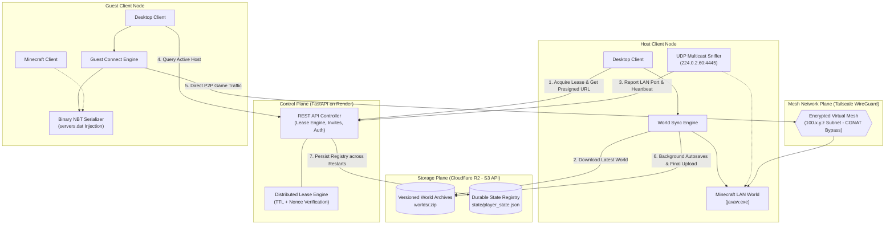

# P2P-WorldSync: Distributed Host Coordination & State Synchronization Engine

> **The Big Idea:** Imagine playing on a shared Minecraft world with your friends that costs **$0/month** and doesn't rely on an expensive 24/7 paid server. Instead of the world being trapped on one person's computer, the save file lives safely in the cloud. Whoever wants to play simply clicks **"Host World"**, picks up the world "baton", and friends connect peer-to-peer with zero port forwarding or IP typing. When the host logs off, the world automatically syncs back to the cloud so the next friend can take over whenever they want.

**Under the Hood:** **P2P-WorldSync** is a decentralized, fault-tolerant game-state relay and peer-to-peer coordination architecture. It decouples persistent world state from local client compute by coupling an atomic distributed lease protocol over S3-compatible Cloudflare R2 object storage with automated Tailscale WireGuard mesh networking. By treating the hosting player as an ephemeral compute node governed by a 30-second heartbeat mutual exclusion lease, any authorized peer can dynamically acquire write authority, stream and atomically unpack authoritative world archives, capture dynamic runtime ports via UDP multicast sniffing, and establish direct peer-to-peer tunnels across Carrier-Grade NAT (CGNAT) boundaries—achieving zero-cost persistent multiplayer with zero manual port forwarding and zero ongoing server compute.

---

## 💡 The Problem & The Solution

| Approach | Limitations & Pain Points | P2P-WorldSync Solution |
|---|---|---|
| **24/7 Paid Server** *(Realms, VPS)* | Costs \$5–\$20/month even when idle; complex configuration and latency overhead. | **$0/month forever.** Runs on free-tier serverless infrastructure (Render + Cloudflare R2). No idle server compute. |
| **Vanilla Singleplayer / LAN** | World save is locked to one person's hard drive; nobody can play if the creator is offline. | **Decoupled cloud world state.** The world "baton" is stored in R2. Whoever clicks **Host** downloads the latest save and plays. |
| **Hamachi / Port Forwarding** | Router CGNAT blocks, firewall vulnerabilities, clunky VPN tools, and manual IP copy-pasting. | **Encrypted private mesh network.** Automated Tailscale WireGuard tunnels bypass CGNAT with zero router port forwarding. |

---

## 🏗️ System Architecture & How It Works



### Technical Pillars

1. **Distributed Mutual Exclusion (Lease Protocol):** Cloud write access is protected by an in-memory lease with a 32-byte cryptographic token. The active host sends heartbeats every 30 seconds. If a host crashes or disconnects, the lease automatically expires after 90 seconds, preventing split-brain world forks.
2. **Zero-Config P2P Discovery & CGNAT Traversal:** Peer traffic routes through an encrypted Tailscale WireGuard virtual network (`100.x.y.z`), bypassing residential CGNAT without opening firewall ports. An internal UDP multicast socket listens on `224.0.2.60:4445` to capture the random LAN port, and the client directly injects it into Minecraft's binary `servers.dat` via `nbtlib`.
3. **Atomic Cloud Sync & Safety Backups:** Uploads write to immutable UUID keys in Cloudflare R2 (`worlds/<UUID>.zip`) and advance the pointer only after SHA-256 verification. If local singleplayer changes are detected before syncing, an automatic timestamped backup is preserved locally.
4. **Crash-Resilient State Persistence:** To accommodate ephemeral serverless runtimes (Render free-tier sleep cycles), player tokens and invite registries are serialized to `state/player_state.json` on Cloudflare R2 and restored automatically upon cold start.

---

## 🕹️ Quickstart: How to Play

### 1. First-Time Setup (Once Only)
1. Run `MinecraftP2P.exe`.
2. Enter the single-use invite code from your server admin, your display name, and email.
3. Click the Tailscale invite link shown on screen to join the private mesh network.

### 2. To Host the World
1. Click **🎮 Host World**. The app syncs the newest cloud save and launches Minecraft.
2. In Minecraft: Press `Esc` $\rightarrow$ **Open to LAN** $\rightarrow$ **Start LAN World**.
3. The app auto-detects your port and broadcasts your connection. While you play, it automatically backs up the world to the cloud every 10 minutes.

### 3. To Join as a Guest
1. Check the app banner (shows **"🟢 [Host] is hosting"**).
2. Click **🚀 Join World**.
3. Open Minecraft $\rightarrow$ **Multiplayer** $\rightarrow$ Double-click **"OurWorld (P2P)"** at the top of your server list!

---

## ⚙️ Deployment & Compilation

### Backend Deployment (Render)

1. Deploy this repository as a **Web Service** on [Render](https://render.com/).
2. Set Build Command: `pip install -r server/requirements.txt`
3. Set Start Command: `uvicorn server.main:app --host 0.0.0.0 --port $PORT`
4. Configure Environment Variables:

| Variable | Purpose |
|---|---|
| `ADMIN_SECRET` | Secret passphrase used to unlock the Admin Panel in the client (`Ctrl+Shift+A`). |
| `R2_ENDPOINT_URL` | Cloudflare R2 S3 endpoint (`https://<account_id>.r2.cloudflarestorage.com`). |
| `R2_ACCESS_KEY_ID` | Cloudflare R2 API access key. |
| `R2_SECRET_ACCESS_KEY` | Cloudflare R2 API secret key. |
| `R2_BUCKET_NAME` | R2 Bucket name (e.g. `minecraft-p2p`). |
| `TAILSCALE_API_KEY` | Tailscale Personal Access Token / OAuth Client Secret. |
| `TAILSCALE_TAILNET` | Set to `-` (default tailnet). |

### Tailscale Access Control (ACL)
In **Tailscale Admin $\rightarrow$ Access Controls**, set an open policy for peers:
```json
{
  "acls": [
    { "action": "accept", "src": ["*"], "dst": ["*:*"] }
  ]
}
```

### Compiling the Client Executable
To build the standalone Windows executable from source:
```powershell
pip install -r client/requirements.txt
pyinstaller --clean client/minecraft_p2p.spec
```
The binary will be compiled to `dist\MinecraftP2P.exe`.

---

## 📁 Repository Structure

```
Minecraft_p2p/
├── client/                     # Desktop Application & Client Sync Engine
│   ├── admin.py                # Admin CLI suite and API operations
│   ├── api_client.py           # HTTP client with exponential backoff & version checks
│   ├── auth.py                 # DPAPI Windows Credential Manager integration
│   ├── autosave.py             # Non-blocking periodic snapshot daemon
│   ├── conflict_manager.py     # Local save state hash tracking & conflict resolution
│   ├── game_launcher.py        # Process automation, PID detection & exit monitoring
│   ├── guest_connect.py        # Direct servers.dat binary NBT injection & join handler
│   ├── heartbeat.py            # Background lease renewal daemon
│   ├── host_session.py         # End-to-end host coordinator
│   ├── lan_sniffer.py          # Multicast UDP packet sniffer (224.0.2.60:4445)
│   ├── main.py                 # Client bootstrap entry point
│   ├── minecraft_p2p.spec      # PyInstaller standalone build specification
│   ├── modpack_manager.py      # Multi-instance world save path resolver
│   ├── ui.py                   # Modern Tkinter desktop application
│   └── world_sync.py           # World compression, SHA-256 verification & R2 sync
├── server/                     # FastAPI Control Plane Backend
│   ├── main.py                 # REST API endpoints, lock state, and rate limiters
│   ├── r2.py                   # Cloudflare R2 S3 SDK, presigned URLs, state persistence
│   └── tailscale.py            # Tailscale v2 REST client for automated user invites
├── docs/                       # Architecture & setup notes
│   ├── packaging-and-antivirus.md
│   └── tailscale-acl.hujson    # Tailscale ACL policy definitions
├── installer/                  # Packaging scripts
│   └── setup.iss               # Inno Setup Windows installer compiler script
├── .env.example                # Template for server environment variables
├── .gitignore                  # Exclusions for Python, artifacts, logs, and secrets
├── LICENSE                     # MIT Open Source License
└── README.md                   # Project documentation
```

---

## 📜 License & Disclaimers

This project is open-source software licensed under the **MIT License**. See the [LICENSE](LICENSE) file for complete details.

*Disclaimer: This project is an independent systems engineering utility and is not affiliated with, endorsed by, or associated with Mojang AB, Microsoft Corporation, or Tailscale Inc. Minecraft is a registered trademark of Mojang Synergies AB.*

---

<p align="center">
  <a href="LICENSE"></a>
  <a href="https://www.python.org/"></a>
  <a href="https://fastapi.tiangolo.com/"></a>
  <a href="https://tailscale.com/"></a>
  <a href="https://www.cloudflare.com/products/r2/"></a>
  <a href="https://www.microsoft.com/windows"></a>
</p>
