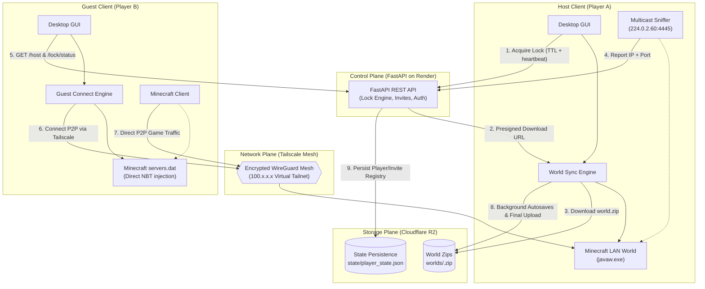
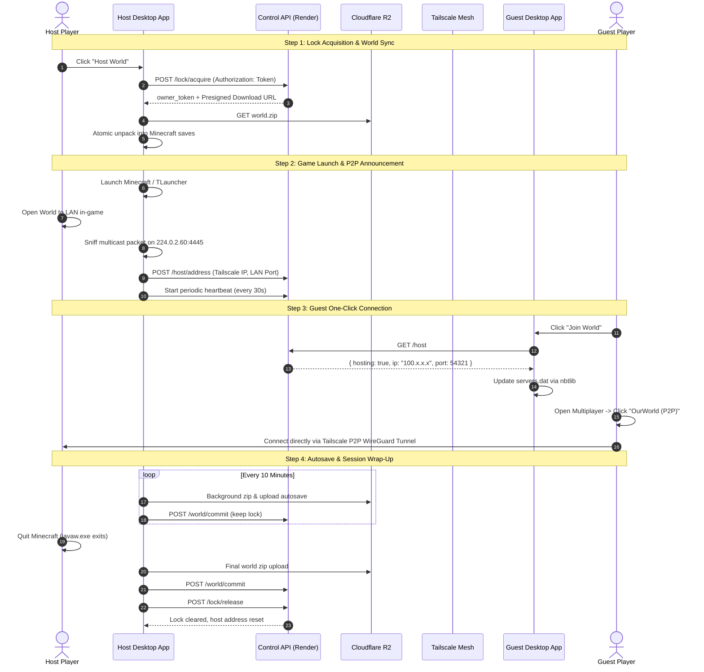

# Minecraft Rotating-Host P2P

A zero-cost, serverless peer-to-peer multiplayer system for private Minecraft groups.

Instead of paying monthly fees for a 24/7 dedicated server, **any player in your group can host the shared world at any time**. The world "baton" is securely synchronized through Cloudflare R2 object storage, and all gameplay network traffic is routed directly peer-to-peer over an encrypted Tailscale WireGuard mesh network.

---

## 🎯 The Problem & The Solution

| Traditional Approach | Pain Point | Rotating-Host P2P Solution |
|---|---|---|
| **24/7 Paid Server** (Realms, VPS) | Monthly subscription costs, idle resource waste | **$0 / month** using free-tier serverless services (Render + Cloudflare R2). |
| **Vanilla LAN / Singleplayer** | Only the original world creator can host; world is stuck on one PC | **Any member can host**; the latest world state downloads and uploads seamlessly. |
| **Port Forwarding / Hamachi** | CGNAT issues, firewall vulnerabilities, clunky manual IP copying | **Encrypted Tailscale mesh**; zero open router ports, direct WireGuard P2P tunnels. |

---

## 🏗️ System Architecture



---

## 🚀 Key Features

### 🔄 Rotating Host Lease & Heartbeat Engine
- **Atomic Lock Acquisition:** Guarantees that only one player can host at a time, preventing split-brain world forks.
- **Continuous Heartbeat:** The active host renews its lease every 30 seconds. If a host crashes or loses internet connectivity, the lease automatically expires within 90 seconds.
- **Live UI Banner:** Real-time indicator displaying who is actively hosting, setting up, or when the server is free.

### ⚡ Zero-Config Guest Joining
- **Multicast LAN Port Detection:** Automatically listens on `224.0.2.60:4445` to capture the ephemeral port generated by Minecraft's "Open to LAN" feature.
- **Direct NBT Injection:** Automatically injects the host's virtual Tailscale IP and port straight into Minecraft's `servers.dat` using `nbtlib`.
- **One-Click Connect:** Guests simply click **Join World** $\rightarrow$ open Minecraft $\rightarrow$ the server is already at the very top of their Multiplayer list.
- **Smart Auto-Retry:** If a guest attempts to connect before the host has finished launching, the app offers to automatically check every 30 seconds until the host is ready.

### ☁️ Cloudflare R2 World Storage Engine
- **Immutability by Design:** Uploads are written to unique versioned keys (`worlds/<uuid>.zip`). The "active" world pointer only advances once the SHA-256 checksum is verified.
- **Background Autosaves:** While hosting, an independent background thread takes incremental snapshots every 10 minutes and commits them to cloud storage without interrupting gameplay.
- **Local Conflict Prevention:** Employs SHA-256 state markers to detect offline singleplayer modifications. If local changes are detected, they are automatically preserved in a timestamped backup before syncing the cloud world.

### 🛡️ State Persistence Across Cold Starts
- **Survives Render Sleep & Redeploy:** Player registries and invite codes are serialised to `state/player_state.json` on Cloudflare R2. Even on Render's ephemeral free tier, player credentials and access tokens persist permanently.
- **Startup World Scanning:** The API scans Cloudflare R2 upon booting up, automatically restoring the latest active world snapshot.

### 👑 Admin Control Suite
- **Single-Use App Invite Codes:** Generate secure, time-limited invite codes (e.g. `MC-XXXX`) with configurable usage limits.
- **Tailscale Seat Management:** Monitor Tailnet user capacity (up to 6 users on the free plan) and revoke players with automatic cleanup of pending invites.
- **Force-Release Stuck Locks:** Administrative override to break orphan or stale host locks if a player disconnected unexpectedly.
- **Full Cloud Clear:** One-click administrative utility to wipe cloud archives and reset to a clean state.

---

## 🔄 Session Lifecycle Walkthrough



---

## 🔒 Security & Privacy Model

- **Zero Client-Side Credentials:** Sensitive infrastructure secrets (`R2_SECRET_ACCESS_KEY`, `TAILSCALE_API_KEY`, `ADMIN_SECRET`) live exclusively on the backend server.
- **Cryptographic Token Verification:** Lock operations require ephemeral 32-byte URL-safe owner tokens verified via `secrets.compare_digest`.
- **Constant-Time Admin Authentication:** Administrative operations are authenticated via `hmac.compare_digest` with exponential lockout throttling after repeated invalid attempts.
- **Encrypted Mesh (WireGuard):** Gameplay network packets never traverse public ports or unencrypted tunnels. Traffic is scoped to the private `100.x.y.z` Tailnet.
- **Scoped Presigned URLs:** Cloudflare R2 upload and download links are presigned with strict 5-minute expiries.

---

## 📋 System Specifications & Requirements

| Component | Requirement |
|---|---|
| **Operating System** | Windows 10 or Windows 11 (64-bit) |
| **Minecraft Version** | Java Edition **1.20.1** (Vanilla, Forge, Fabric, or TLauncher) |
| **Java Runtime** | Java 17+ (64-bit) |
| **Virtual Mesh** | [Tailscale](https://tailscale.com/) installed and authenticated |
| **Backend Hosting** | [Render](https://render.com/) Web Service (Python 3.10+) |
| **Object Storage** | [Cloudflare R2](https://www.cloudflare.com/products/r2/) S3-compatible bucket |

---

## 📂 Repository Structure

```
Minecraft_p2p/
├── client/                     # Desktop GUI and Client Sync Engine
│   ├── admin.py                # Admin CLI operations and client wrapper
│   ├── api_client.py           # HTTP client with retry, backoff, and version validation
│   ├── auth.py                 # Windows Credential Manager integration & token storage
│   ├── autosave.py             # Non-blocking periodic cloud snapshot thread
│   ├── conflict_manager.py     # Local save backup, marker tracking, and conflict resolution
│   ├── game_launcher.py        # Launcher automation, PID detection, and exit monitoring
│   ├── guest_connect.py        # Direct servers.dat NBT manipulation and guest join logic
│   ├── heartbeat.py            # Background lock renewal daemon
│   ├── host_session.py         # End-to-end host coordinator
│   ├── lan_sniffer.py          # Multicast UDP sniffer for Minecraft LAN announcements
│   ├── main.py                 # Client bootstrap entry point
│   ├── minecraft_p2p.spec      # PyInstaller single-binary build configuration
│   ├── modpack_manager.py      # Multi-instance world save path resolver
│   ├── ui.py                   # Modern Tkinter desktop application
│   └── world_sync.py           # World compression, SHA-256 verification, and R2 sync
├── server/                     # FastAPI Control Plane Backend
│   ├── main.py                 # REST API endpoints, lock state, and rate limiters
│   ├── r2.py                   # Cloudflare R2 S3 SDK, presigned URLs, state persistence
│   └── tailscale.py            # Tailscale v2 REST client for automated user invites
├── docs/                       # Architectural documentation
│   ├── packaging-and-antivirus.md
│   └── tailscale-acl.hujson    # Tailscale ACL policy definitions
├── installer/                  # Packaging scripts
│   └── setup.iss               # Inno Setup Windows installer compiler script
├── .env.example                # Template for server environment variables
├── .gitignore                  # Git exclusions for Python, artifacts, logs, and secrets
├── LICENSE                     # MIT Open Source License
└── README.md                   # Project documentation
```

---

## ⚙️ Deployment & Setup Guide

### 1. Backend Server Deployment (Render)

1. Fork or clone this repository to GitHub.
2. In [Render Dashboard](https://dashboard.render.com/), create a new **Web Service** pointing to your repository.
3. Configure the runtime settings:
   - **Environment:** `Python 3`
   - **Build Command:** `pip install -r server/requirements.txt`
   - **Start Command:** `uvicorn server.main:app --host 0.0.0.0 --port $PORT`
4. Set the following **Environment Variables**:

| Variable | Description |
|---|---|
| `ADMIN_SECRET` | Strong random secret string used to access the Admin Panel. |
| `R2_ENDPOINT_URL` | Cloudflare R2 S3 endpoint URL (`https://<account_id>.r2.cloudflarestorage.com`). |
| `R2_ACCESS_KEY_ID` | Cloudflare R2 API access key. |
| `R2_SECRET_ACCESS_KEY` | Cloudflare R2 API secret key. |
| `R2_BUCKET_NAME` | Name of your R2 bucket (e.g. `minecraft-p2p`). |
| `TAILSCALE_API_KEY` | Tailscale Personal Access Token or OAuth Client secret. |
| `TAILSCALE_TAILNET` | Set to `-` to target the default tailnet. |

---

### 2. Tailscale ACL Configuration

Navigate to **Tailscale Admin Console $\rightarrow$ Access Controls** and set an open ACL so invited members can communicate across all ports:

```json
{
  "acls": [
    {
      "action": "accept",
      "src": ["*"],
      "dst": ["*:*"]
    }
  ]
}
```

---

### 3. Compiling the Client Executable

To compile a standalone, windowed Windows executable:

```powershell
# From the repository root
pip install -r client/requirements.txt
pyinstaller --clean client/minecraft_p2p.spec
```

The resulting standalone executable will be located at:
```
dist\MinecraftP2P.exe
```

---

### 4. Player Onboarding Workflow

1. **Admin Generation:** The server administrator opens the app, presses `Ctrl+Shift+A` (or clicks `⚙ Admin`), authenticates with `ADMIN_SECRET`, and clicks **Generate New Invite Code**.
2. **Player Registration:** The new player runs `MinecraftP2P.exe`, enters the invite code, display name, and email address.
3. **Tailscale Connection:** An interactive prompt displays their personalized Tailscale invite URL. Clicking the link joins them to the private Tailnet.
4. **Ready to Play:** The token is securely stored in the Windows Credential Manager. All subsequent launches skip onboarding and proceed directly to the Hub.

---

## 📜 License

This project is licensed under the **MIT License**. See the [LICENSE](LICENSE) file for complete details.

---

## ⚠️ Disclaimer

This project is an independent tool and is not affiliated with, endorsed by, or associated with **Mojang AB**, **Microsoft Corporation**, or **TLauncher**. *Minecraft* is a registered trademark of Mojang Synergies AB.

---

<p align="center">
  <a href="LICENSE"></a>
  <a href="https://www.python.org/"></a>
  <a href="https://fastapi.tiangolo.com/"></a>
  <a href="https://tailscale.com/"></a>
  <a href="https://www.cloudflare.com/products/r2/"></a>
  <a href="https://www.microsoft.com/windows"></a>
</p>

